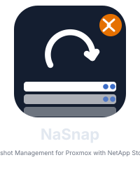

<p align="center">
  
</p>

# NaSnap — NetApp® ONTAP® Snapshot Manager for Proxmox VE

A self-contained web application that brings VM-consistent NetApp® ONTAP® snapshot management to Proxmox VE environments. Runs as a single Docker container with built-in authentication, SQLite database, and a clean UI with three themes: dark, light, and the new Liquid Glass theme.

**Current stable: 1.8.0** · [Changelog](CHANGELOG.md)

---

## What NaSnap does

NaSnap connects to one or more NetApp ONTAP systems and gives you full snapshot lifecycle management for Proxmox VE — from a standalone web UI that any browser can reach:

- **Snapshot** any VM or set of VMs on a shared ONTAP datastore — crash-consistent, app-consistent (QEMU guest agent), or suspend-based.
- **Restore** individual VMs (SFSR for NFS, LV copy for SAN) or revert an entire datastore to a snapshot in seconds (volume revert).
- **Clone** VMs from any snapshot to a new VMID with fresh MAC addresses.
- **Instant Recovery** *(Alpha, NFS only)* — Veeam-style instant boot: a VM starts directly off a NetApp FlexClone of the datastore volume, with no data copied up front. Test the VM (optionally network-isolated with fresh MACs to avoid IP/MAC collisions with the source), then either **Storage Migrate** it onto a permanent datastore live (falling back to a brief automatic stop/restart only if the VM has a TPM device, which ONTAP/PVE can't move while running) or **Discard** it to tear the clone down with no lasting footprint. Also works from a live VM (takes a small ad-hoc snapshot first). Sessions left running past 3 days get a log reminder to commit or discard.
- **Protect datastores with Protection Plans** — assign multiple datastores to a single plan with unified scheduling, retention, hooks, and email notifications. Each datastore runs as an independent job (Veeam-style); a consolidated email summarises all results per plan run.
- **Replicate** snapshots to a secondary ONTAP cluster via SnapMirror® and restore or clone directly from the replica — without touching the primary.
- **Set up SnapMirror/SnapVault replication in one click** *(Alpha)* — pick a second registered NetApp system and NaSnap automatically peers the clusters and SVMs (if not already peered), then creates the relationship with an existing or newly created policy (Mirror for DR, Vault for retention). Available at provisioning time or retroactively via the datastore's **SnapMirror / Vault** action, which also handles policy changes and safely breaking/removing a relationship (optionally keeping the destination volume for restore).
- **FlexGroup volumes** *(Alpha, NFS only)* — provision a datastore as a FlexGroup spanning multiple aggregates instead of a single-aggregate FlexVol, for datastores that need to scale past a single aggregate's capacity.
- **Lock snapshots** with ONTAP Snapshot Locking (WORM / tamperproof) — set an expiry time that prevents deletion even by ONTAP admins, protecting against ransomware and accidental removal. Independent locking for source and SnapMirror destination.
- **Provision** new SAN datastores end-to-end (iSCSI and NVMe-oF): ONTAP volume + LUN/namespace + iGroup/subsystem creation, host-side iSCSI/NVMe setup, LVM VG creation, and PVE storage registration — in a single wizard.
- **Disaster Recovery** *(In Development)* — single-instance DR: SnapMirror-based failover (planned/emergency) with ordered VM boot groups, and a **Recover VMs** wizard that provisions a fresh or existing standby cluster with storage, then imports and restarts the VMs from it. No second coordinating NaSnap instance required — the same instance manages both the primary and DR side.
- **Bulk Migrate** — move a set of VMs from one datastore to another with live progress tracking, driven entirely from NaSnap (something Proxmox has no built-in equivalent for).
- **Datastore Index** — every NFS snapshot is self-describing via a `.nasnap/index.json` file written before each ONTAP snapshot. The index travels inside the snapshot, enabling import of historical snapshots on any NaSnap instance without a database — even after a complete reinstall. An optional startup auto-scan reconciles all visible datastores automatically.
- **Manage users** — built-in admin/viewer roles with Argon2id password hashing and AES-256-GCM encrypted ONTAP credentials.
- **Active Directory / LDAP authentication** *(Beta)* — connect NaSnap to your AD domain. Users authenticate with their AD credentials; group membership determines the role (Admin or Viewer). Local accounts always remain active as a fallback — even when AD is unreachable.

All operations run as background jobs with live log streaming. Every snapshot embeds a manifest (VM inventory + configs) that travels inside the ONTAP snapshot, making restores self-contained.

---

## Feature Matrix

| Feature | NFS | iSCSI | NVMe-oF |
|---|:---:|:---:|:---:|
| Auto-Discovery | ✅ | ✅ | ✅ |
| VM-consistent Snapshots (crash / app / suspend) | ✅ | ✅ | ✅ |
| Scheduled Snapshots with Retention | ✅ | ✅ | ✅ |
| Pre/Post Snapshot Hooks (scripts per schedule) | ✅ | ✅ | ✅ |
| SnapMirror Transfer Trigger per Schedule | ✅ | ✅ | ✅ |
| Email Notifications per Schedule | ✅ | ✅ | ✅ |
| Manifest (VM inventory, disk layout, configs) rides inside ONTAP snapshot | ✅ | ✅ | ✅ |
| Tamperproof Snapshots (ONTAP Snapshot Locking / WORM, requires ONTAP 9.12.1+) | 🟠 Alpha | 🟠 Alpha | 🟠 Alpha |
| SnapMirror Destination Tamperproof (independent lock duration) | 🟠 Alpha | 🟠 Alpha | 🟠 Alpha |
| Restore — SFSR (Single File / VM Disk, NFS only) | ✅ | ❌ n/a | ❌ n/a |
| Single File Restore (SFR) — browse snapshot filesystem, copy files/dirs into live VM via QGA | ✅ | 🟠 Alpha | 🟠 Alpha |
| Restore — Single VM (LV-copy via temp clone) | ❌ n/a | 🟡 Beta | 🟡 Beta¹ |
| Restore — Volume Revert (all VMs) | ✅ | 🟡 Beta | 🟡 Beta |
| VM Clone from snapshot | ✅ | 🟡 Beta | 🟡 Beta¹ |
| Instant Recovery (boot from FlexClone, commit or discard) | 🟠 Alpha | ❌ n/a | ❌ n/a |
| Clone from ONTAP-native snapshots | ✅ | 🟡 Beta | 🟡 Beta |
| Multi-VM snapshot | ✅ | 🟡 Beta | 🟡 Beta |
| ONTAP-native snapshot visibility | ✅ | 🟡 Beta | 🟡 Beta |
| SnapMirror® visibility & DR restore/clone | ✅ | 🟡 Beta | 🟡 Beta |
| Storage Provisioning (auto-setup) | ✅ | 🟡 Beta | 🟡 Beta |
| FlexGroup volumes (spans multiple aggregates) | 🟠 Alpha | ❌ n/a | ❌ n/a |
| SnapMirror/SnapVault replication setup (auto cluster+SVM peering, policy create/select) | 🟠 Alpha | 🟠 Alpha | 🟠 Alpha |
| Storage Resize | ✅ grow & shrink | 🟡 Beta grow only | 🟡 Beta grow only |
| Job Cancellation | ✅ | 🟡 Beta | 🟡 Beta |
| Recover VMs from Datastore (adopt existing volumes with VMs, DR tab) | 🟠 Alpha | 🟠 Alpha | 🟠 Alpha |
| Datastore Index (self-describing index per snapshot) | ✅ NFS | ✅ snapmanifest LV | ✅ snapmanifest LV |
| Startup auto-scan (reconcile index into DB on start) | ✅ | ✅ | ✅ |
| PVE Host Maintenance (check/clean stale mounts, SFR dirs, LVM VGs; verify storage stack packages & services) | ✅ | ✅ | ✅ |
| Dashboard (7-day stats, timeline, protection overview, alerts) | ✅ | ✅ | ✅ |
| Full DR Failover (planned & emergency, single-instance) | 🔵 In Development | 🔄 Planned | 🔄 Planned |
| DR Test via FlexClone | 🔄 Planned | 🔄 Planned | 🔄 Planned |
| DR Failback | 🔄 Planned | 🔄 Planned | 🔄 Planned |

Legend: ✅ Stable · 🟡 Beta · 🟠 Alpha · 🔵 In Development · 🔄 Planned · ❌ N/A

### Platform Features

These features are application-level and independent of the storage protocol.

| Feature | Status |
|---|:---:|
| Built-in Auth (admin / viewer roles, Argon2id password hashing) | ✅ |
| Active Directory / LDAP Authentication (group→role mapping) | 🟡 Beta |
| AES-256-GCM Credential Encryption at Rest | ✅ |
| DB Export / Import (full config + user backup) | ✅ |
| Dark / Light / Liquid Glass Theme | ✅ |
| PVE Cluster Grouping (auto-detected via `/cluster/status`, Settings → PVE Hosts) | 🟠 Alpha |
| Bulk Migrate (move VMs between datastores with live progress) | 🟠 Alpha |

¹ NVMe Single VM Restore and Clone on ASA use a full volume clone via the ONTAP CLI bridge (`private/cli/volume/clone`). Direct namespace clone APIs are not available on ASA, but the volume clone approach achieves identical results.

---

> **Maturity levels:**
> - ✅ **Stable** — Tested in a lab environment and found to be reliable and stable under test conditions.
> - 🟡 **Beta** — Implemented and partially tested. Occasional errors may still occur that require investigation. Use with caution.
> - 🟠 **Alpha** — Implemented, but real-environment testing is still limited. Errors may require manual intervention. Not suitable for routine production use.
> - 🔵 **In Development** — Feature is implemented in code but has not been fully tested yet or is still being refined.
> - 🔄 **Planned** — Not yet implemented.
> - ❌ **N/A** — Not applicable for this protocol.
>
> **Protocol status:**
> - 🟢 **NFS** — Stable. All core workflows (snapshot, restore, clone, SnapMirror DR) are fully implemented and tested.
> - 🟡 **SAN — iSCSI** — Beta. Auto-discovery, snapshots, schedules, single-VM restore, volume revert, VM clone, end-to-end provisioning, and SnapMirror DR restore/clone are fully implemented and tested.
> - 🟡 **SAN — NVMe-oF** — Beta. Auto-discovery, snapshots, schedules, single-VM restore, volume revert, VM clone, end-to-end provisioning, and SnapMirror DR restore/clone are fully implemented and tested on NetApp ASA (NVMe/TCP, ONTAP 9.18.1) and AFF (NVMe/TCP, ONTAP 9.16.1).

---

## Platform & Protocol Compatibility

| Platform | Protocol | Snapshot | Single VM Restore | Volume Revert | Clone |
|---|---|:---:|:---:|:---:|:---:|
| FAS / AFF | NFS | ✅ | ✅ SFSR | — | ✅ FlexClone |
| FAS / AFF | iSCSI | ✅ | ✅ LUN clone | ✅ | ✅ LUN clone |
| FAS / AFF | NVMe-oF | ✅ | ✅ NS clone | ✅ | ✅ NS clone |
| ASA | iSCSI | ✅ | ✅ LUN clone | ✅ | ✅ LUN clone |
| ASA | NVMe-oF | ✅ | ✅ Volume clone² | ✅ | ✅ Volume clone² |

² ASA NVMe uses `POST private/cli/volume/clone` (CLI bridge) instead of the native REST namespace clone. The restore/clone result is identical to iSCSI/FAS/AFF.

---

## Requirements

### Docker

| Component | Version |
|---|---|
| Docker Engine | 20.x or later |
| Docker Compose | v2 |

### ONTAP

All features are included in **ONTAP One** (ONTAP 9.10.1+) at no extra cost:

| Feature | License | Included in ONTAP One |
|---|---|---|
| Volume Snapshots | Base | ✓ |
| Single-File Snapshot Restore (SFSR) | SnapRestore® | ✓ |
| Volume Snapshot Restore (revert) | SnapRestore® | ✓ |
| FlexClone | FlexClone® | ✓ |
| NVMe-oF / iSCSI | SAN | ✓ |
| Snapshot Locking (Tamperproof / WORM) | Base | ✓ — requires ONTAP 9.12.1+ |

**Tested platforms:** ONTAP 9.13+ (NFS/iSCSI), NetApp ASA (All-SAN Array) with NVMe/TCP on ONTAP 9.18.1, NetApp AFF with NVMe/TCP on ONTAP 9.16.1 — including end-to-end provisioning, snapshot, restore, clone, and SnapMirror DR restore/clone.

### Proxmox VE

Proxmox VE 7.x or 8.x on the managed hosts.

**For NFS** — no additional packages required on PVE nodes.

**For iSCSI:**
```bash
apt install open-iscsi multipath-tools lvm2
```

**For NVMe-oF:**
```bash
apt install nvme-cli lvm2
modprobe nvme-tcp
echo nvme-tcp >> /etc/modules-load.d/nvme-tcp.conf
```

### Network access from the NaSnap container

```
NaSnap  →  ONTAP cluster-mgmt  TCP 443
NaSnap  →  Proxmox VE nodes    TCP 22 (SSH)
NaSnap  →  SMTP server         TCP 25/465/587  (optional, for email notifications)
```

---

## Quick Start

```bash
# 1. Clone
git clone https://github.com/custosonlinux/nasnap.git
cd nasnap

# 2. Build image
./build-docker.sh

# 3. Configure
cp .env.example .env
# Edit .env — set NASNAP_ADMIN_PASSWORD and SECRET_KEY

# 4. Start
docker compose up -d

# 5. Open
# http://your-host:5000   →   log in with admin / <NASNAP_ADMIN_PASSWORD>
```

After logging in, open **Settings → Initial Setup** to walk through ONTAP connectivity, dedicated user creation, SSH key setup, and first discovery.

---

## Environment Variables

| Variable | Default | Description |
|---|---|---|
| `NASNAP_ADMIN_PASSWORD` | `admin` | Password for the default `admin` account (applied on first start only) |
| `SECRET_KEY` | *(random)* | HMAC key for session tokens — **always set a stable value in production** |
| `SESSION_HOURS` | `8` | Session lifetime in hours |
| `WORKERS` | `1` | Gunicorn worker processes — keep at 1; the background scheduler thread is single-instance and must not run in multiple workers |
| `NASNAP_DATA` | `/data` | Persistent data directory (DB + AES key) |
| `DEBUG` | — | Set to `1` for Flask debug mode and the `/dev/autologin` shortcut |
| `SFR_COPY_LIMIT_MB` | `200` | Maximum file size (MB) that Single File Restore will copy into a VM via QGA. Larger files must be downloaded locally. See the [SFR performance note](#single-file-restore-sfr--performance--limits) below. |
| `TZ` | `UTC` | Fallback global timezone for time-of-day settings (e.g. the digest report's send time) and server-rendered email timestamps, used only until a global timezone is set in **Settings → System Timezone** (which then takes over without needing a restart). Interactive UI timestamps use each user's own timezone (**Settings → Profile**) instead, independent of this variable. Set to an [IANA zone name](https://en.wikipedia.org/wiki/List_of_tz_database_time_zones) such as `Europe/Berlin`. |

> **Port and TLS** are configured via **Settings → Server/Network** in the UI and persisted in `/data/server.json`. The container uses `network_mode: host` so port changes take effect on the next restart without modifying `docker-compose.yml`.

### Minimal `.env` for production

```env
NASNAP_ADMIN_PASSWORD=<strong-password>
SECRET_KEY=<output-of: openssl rand -hex 32>
```

---

## Data Persistence

Everything lives in `NASNAP_DATA` (Docker volume `nasnap_data` → `/data`):

| File | Contents |
|---|---|
| `nasnap.db` | SQLite — users, sessions, snapshots, schedules, endpoints, DR config |
| `.nasnap_aes256.key` | AES-256-GCM key used to encrypt ONTAP passwords at rest |
| `server.json` | Port and TLS mode (set via Settings → Server/Network) |
| `tls/cert.pem`, `tls/key.pem` | Auto-generated self-signed TLS certificate (created on first start when HTTPS is selected) |

> **Important:** back up the entire `/data` directory before upgrading. The AES key and the database must stay together — the key is not recoverable, and without it all stored ONTAP passwords become unreadable.

### DB Export / Import

Open **Settings → Export** to download a complete JSON backup of all configuration (endpoints, schedules, DR plans, volume mappings, SMTP, and user accounts). Use **Settings → Import** to restore.

---

## Upgrading

```bash
./build-docker.sh          # rebuild image with latest code
docker compose up -d       # rolling restart — data volume is preserved
```

Database migrations run automatically on startup.

---

## User Management

Open **`/admin`** (top bar → Users) to create and delete users and reset passwords.

| Role | Access |
|---|---|
| `admin` | Full access — all features + user management |
| `viewer` | Read-only — can view snapshots, jobs, and schedules |

The default `admin` account is created on first start using `NASNAP_ADMIN_PASSWORD`.

### Active Directory / LDAP

Configure AD/LDAP in **Settings → Active Directory / LDAP**:

| Field | Description |
|---|---|
| Server | DC hostname or IP |
| Port | 389 (plain/STARTTLS) or 636 (LDAPS) |
| Encryption | None, STARTTLS, or SSL/LDAPS |
| Bind DN | Service account in UPN (`svc@domain.tld`) or DN format |
| Bind Password | Service account password |
| Base DN | Search root, e.g. `DC=corp,DC=example,DC=com` |
| User Filter | LDAP filter to locate the user — `{username}` is substituted. Default: `(sAMAccountName={username})` |
| Admin Group DN | Full DN of the AD group that grants `admin` role |
| Viewer Group DN | Full DN of the AD group that grants `viewer` role |

**Login flow:** local accounts are checked first; if no matching local account exists, LDAP is attempted. If the AD user is not a member of either configured group, login is denied. Local accounts (especially the built-in `admin`) always remain active — they are never blocked by LDAP configuration.

---

## Setup

### 1. ONTAP user

Create a dedicated ONTAP user. The required role depends on which features you use:

**Snapshots and restore only (NFS):**
```bash
security login role create -role nasnap-snap -cmddirname "volume snapshot"             -access all
security login role create -role nasnap-snap -cmddirname "volume snapshot restore"      -access all
security login role create -role nasnap-snap -cmddirname "volume snapshot restore-file" -access all
security login role create -role nasnap-snap -cmddirname "storage/file/clone"           -access all

security login create -user-or-group-name nasnap \
  -application http -authmethod password -role nasnap-snap
```

**Full feature set (SAN provisioning, iSCSI/NVMe, SnapMirror):**
```bash
security login create -user-or-group-name nasnap \
  -application http -authmethod password -role admin
```

> The `admin` role is needed for provisioning operations: creating volumes, LUNs, NVMe subsystems/namespaces, iGroups, and SnapMirror management.

### 2. Add ONTAP endpoint

In the UI under **Settings → NetApp Systems → Add**:

| Field | Description |
|---|---|
| Name | Friendly label (e.g. `prod-cluster`) |
| Host | Cluster management LIF hostname or IP |
| Username / Password | ONTAP credentials |
| SSL Verify | Recommended: enabled |

### 3. Add Proxmox host

Under **Settings → Proxmox Hosts → Add** — add each Proxmox node or cluster that has datastores backed by ONTAP. Standalone nodes (not in a PVE cluster) are supported.

### 4. Run Auto-Discovery

Under **Settings → Discovery → Run** — NaSnap scans your Proxmox hosts for NFS, iSCSI, and NVMe datastores and matches them to ONTAP volumes automatically.

---

## SAN-specific setup (iSCSI / NVMe-oF)

### snapmanifest LV

SAN datastores (LVM-over-iSCSI or LVM-over-NVMe) do not have a filesystem that can hold manifest files. NaSnap uses a small dedicated LV called **snapmanifest** that lives inside the same VG as your VM disks. It is formatted ext4 (64 MB by default) and rides inside every ONTAP snapshot automatically.

After discovery has found your SAN mapping, click **"Setup snapmanifest"** next to the mapping in the Settings tab. This is a one-time operation per VG.

### Restore methods (SAN)

Two restore methods are available. NaSnap selects the correct options automatically based on platform and protocol.

#### Single VM Restore (iSCSI / NVMe)

Restores only the target VM's logical volumes without affecting other VMs on the same datastore:

1. The target VM is stopped.
2. A temporary clone is created from the snapshot on ONTAP (LUN clone for iSCSI; namespace clone for FAS/AFF NVMe; volume clone via CLI bridge for ASA NVMe).
3. The clone is mapped to the Proxmox host.
4. `vgimportclone` imports the clone's LVM VG under a temporary name.
5. Each disk LV of the target VM is copied (`dd bs=512M iflag=direct oflag=direct`) from the temporary VG to the live VG.
6. The temporary clone is unmapped and deleted from ONTAP.
7. The VM config is restored from the NaSnap database.
8. The VM is started.

Other VMs on the same datastore remain running throughout.

#### Volume Revert (all SAN, including ASA NVMe)

Reverts the entire ONTAP volume to the snapshot state — affects **all VMs** on that datastore:

1. The target VM is stopped.
2. The LVM VG is deactivated on the Proxmox host (`vgchange -an`).
3. ONTAP reverts the entire volume to the snapshot state.
4. The VG is re-scanned and reactivated (`pvscan --cache && vgchange -ay`).
5. The VM config is restored from the NaSnap database.
6. The VM is started.

> ⚠️ **Volume Revert is destructive**: all data written to the volume *after* the snapshot is permanently lost. All VMs on the same SAN datastore are affected.

### multipath.conf — NetApp recommended settings

Required on every PVE node for iSCSI. Add to `/etc/multipath.conf`:

```
defaults {
    find_multipaths    yes
    user_friendly_names yes
}
devices {
    device {
        vendor                "NETAPP"
        product               "LUN.*"
        path_grouping_policy  group_by_prio
        prio                  alua
        hardware_handler      "1 alua"
        failback              immediate
        path_checker          tur
        no_path_retry         queue
        features              "3 queue_if_no_path pg_init_retries 50"
        rr_weight             uniform
        rr_min_io_rq          1
    }
}
```

After writing: `systemctl restart multipathd`.

---

## Storage Provisioning (NFS / iSCSI / NVMe-oF)

The **Provisioning** tab automates the complete setup of a new datastore — from ONTAP object creation to PVE storage registration — across all cluster nodes in a single operation.

**NFS:**
1. Create (or reuse) a volume and dedicated export policy; add per-host export rules.
2. Register the PVE storage cluster-wide (`pvesm add nfs`).
3. Create `.netapp-snapmanifest/` inside the mount point.

**iSCSI:**
1. Create (or reuse) a thin-provisioned volume, LUN, and iGroup; add all selected host IQNs; map the LUN.
2. Per PVE host — iSCSI discovery, target login, multipath device detection.
3. First host — `pvcreate`, `vgcreate`; all hosts — `pvscan --cache -aay`.
4. Register LVM/LVM-thin storage cluster-wide.

**NVMe-oF:**
1. Create (or reuse) a namespace and NVMe subsystem; add all selected host NQNs; map the namespace. Supports AFF/FAS and ASA with automatic API fallback.
2. Per PVE host — `nvme connect-all`, namespace rescan, wait for block device.
3. First host — `pvcreate`, `vgcreate`, snapmanifest LV initialization; all hosts — `pvscan --cache -aay`.
4. Register LVM/LVM-thin storage cluster-wide.

The Provisioning tab also handles **resize** (non-disruptive for running VMs) and **teardown** (PVE deregistration, VG removal, ONTAP LUN/namespace/volume deletion).

---

## Datastore Index (Self-Describing Snapshots)

Every NFS snapshot taken by NaSnap is self-describing. Before each ONTAP snapshot, NaSnap writes a `.nasnap/index.json` file to the datastore mount via SSH. Because the file exists on the live filesystem when the snapshot is created, it is automatically baked into the ONTAP snapshot — no secondary store or external database needed.

### What the index contains

```json
{
  "nasnap_version": "1",
  "schema_version": 1,
  "datastore_name": "aff-nfs-ds01",
  "ontap_svm": "svm1",
  "ontap_volume": "vol_nfs_ds01",
  "ontap_volume_uuid": "...",
  "vms_current": [{ "vmid": 101, "name": "web01" }],
  "snapshots": [
    {
      "ontap_snapshot_name": "NaSnap_20260619_0200_nightly",
      "taken_at": "2026-06-19T02:00:03Z",
      "schedule_name": "nightly",
      "consistent": true,
      "locked": false,
      "vms": [{ "vmid": 101, "name": "web01", "config_sha256": "..." }]
    }
  ]
}
```

### Storage by protocol

| Protocol | Index location | Mechanism |
|---|---|---|
| NFS | `<mount>/.nasnap/index.json` | SSH write to NFS mount before snapshot |
| iSCSI | `netapp_snapmanifest` LV — `index.json` at LV root | LV activated → mounted → written → unmounted before snapshot |
| NVMe-oF | `netapp_snapmanifest` LV — `index.json` at LV root | Same as iSCSI |

For SAN, the snapmanifest LV must be initialized first (Storage tab → **Setup snapmanifest**). The index write uses a dedicated mount session separate from the manifest write so both files are current when the ONTAP snapshot fires.

### Scanning and importing

- **Storage tab → ⟳ Index** — manually scan any datastore (NFS or SAN) and import snapshots missing from the local database (marked `source = index_import`). For SAN, the snapmanifest LV must be initialized.
- **Settings → Auto-scan on startup** — enable to automatically scan all datastores (NFS and SAN) on every NaSnap start. Useful after a fresh install or when taking over an existing environment.
- **Restore & Clone** — snapshots imported from the index appear in the per-VM restore wizard alongside plugin-managed snapshots. An *Imported* badge identifies their origin, and the **Imported** filter in the header narrows the VM list to entries with at least one index-imported snapshot.
- **Import VMs** — the VM import wizard now uses the datastore index as its primary snapshot source (faster, offline-capable). Falls back to the legacy manifest directory when no index is present.

### Format notes

- The index is written atomically (`.tmp` → `mv` for NFS, same pattern on SAN) to prevent partial reads during concurrent snapshot operations.
- A single ONTAP volume may appear in multiple `netapp_volume_mapping` rows (one per PVE host). NaSnap deduplicates by `volume_uuid` to avoid duplicate DB entries.

---

## Tamperproof Snapshots (ONTAP Snapshot Locking)

Tamperproof locking sets an `expiry_time` on ONTAP snapshots, making them undeletable until the expiry date passes — even by ONTAP cluster administrators. This protects against ransomware attacks that try to delete backups before encrypting data, and satisfies regulatory requirements (GDPR, BSI, etc.).

**Requirements:** ONTAP 9.12.1 or later. Volume must have snapshot locking enabled (`volume modify -snapshot-locking-enabled true`). Requires ONTAP `admin` role.

### Source locking

Enable per schedule under **Schedules → Step 2 — Tamperproof Lock**. NaSnap calculates the maximum safe lock duration automatically:

```
max_lock_days = floor((retention_count - 1) × interval_days)
```

This ensures the lock expires before the retention policy would attempt to delete the snapshot. A warning is shown if you exceed the maximum.

### SnapMirror destination locking

Enable independently under **Schedules → Step 4 — SnapMirror → Destination Tamperproof**. After each SnapMirror transfer, NaSnap polls the destination volume until the replicated snapshot appears, then sets the expiry. Lock duration for the destination is configured separately from the source.

The destination section is greyed out when "Trigger SnapMirror transfer" is not enabled.

---

## Email notifications

Each schedule/Protection Plan can send email notifications on snapshot job completion. Configure SMTP under **Settings → SMTP**, then enable notifications per schedule. An optional periodic **digest report** (daily/weekly, Settings → Email Notifications) separately summarizes snapshot success/failure per plan and flags datastores approaching a configurable capacity threshold — its send time is interpreted in the global timezone (**Settings → System Timezone**, falls back to the `TZ` environment variable, see [Environment Variables](#environment-variables)).

All notification emails (per-run, digest, and the "Send test email" preview) share one visual design:
- **Status banner** — full-width, colour-coded: green (success), amber (success with warnings), red (failure).
- **KPI tiles** — at-a-glance counts (e.g. datastores OK, VMs protected, SnapMirror healthy) directly under the banner.
- **Action-needed callout** — failures/at-risk items surfaced in a red box above everything else, so they never hide inside a longer list.
- **Compact cards** — one card per datastore/plan/entry, colour-coded left border, instead of a dense table row.
- **Dark terminal log block** — job log lines with `[INFO]` / `[WARN]` / `[ERR]` severity tags, shown for failed entries.
- **Plain-text fallback** — included as a `text/plain` MIME part.

---

## PVE Host Maintenance

**Settings → PVE Host Maintenance** scans all configured Proxmox hosts via SSH and reports stale resources left behind by interrupted or failed operations. A single click cleans up any individual host.

### What it checks (per host)

| Category | Details |
|---|---|
| Stale NFS mounts | NFS paths that return "Stale file handle" — typically from deleted or migrated ONTAP volumes. These cause `df` and PVE storage operations to hang. |
| SFR temp directories | `/tmp/nasnap-sfr-*` directories left by interrupted Single File Restore sessions — including any active NBD device and mount. |
| Leftover LVM VGs | LVM VGs named `nasnap_sfr_*` left by aborted SFR SAN sessions. |

### Cleanup

For each item, NaSnap performs a full teardown in the correct order:

- **Stale NFS:** `umount -l <path>`
- **SFR dirs:** `fuser -km` on the mount → NBD disconnect → `umount` → `rm -rf`
- **LVM VGs:** `vgchange -an` → `vgremove -f`

After cleanup, the health check re-runs automatically to confirm.

---

## Job management

All snapshot, restore, and clone operations run as background jobs visible under **Jobs & History**.

- **Cancel**: Running jobs can be cancelled. The job stops at the next safe checkpoint and cleans up any partial work (temporary ONTAP clones, imported VGs, reserved VMIDs).
- **Delete**: Completed, failed, or cancelled jobs can be deleted individually or in bulk via "Cleanup".
- **Stale jobs**: Any job still "running" when NaSnap restarts (e.g. after a crash) is automatically reconciled at startup and marked failed — no manual Cancel needed. DR plans caught mid-failover get their state reconciled the same way, by checking the real SnapMirror relationship state on the DR side rather than assuming the worst.

---

## Troubleshooting

### Stale iSCSI clone LUN after a failed job

If a clone or restore job fails after the temporary ONTAP LUN was mapped to the Proxmox host but before cleanup completes, the host may be left with a stale multipath device. Because the NetApp multipath configuration uses `no_path_retry queue`, any process that touches the lost device — including LVM (`vgs`, `pvs`) — will **hang indefinitely**.

**Cleanup — run on every affected PVE host:**

1. Identify the stale WWID: `multipath -ll | grep -B1 'failed faulty'`
2. Disable I/O queuing: `multipathd disablequeueing map <WWID>`
3. Flush the device: `multipath -f <WWID>`
4. Remove stale SCSI paths: `echo 1 > /sys/block/<dev>/device/delete` for each path
5. Delete the temporary ONTAP clone volume (named `nsclone_<job_id>` in current builds) via System Manager or CLI
6. Verify: `multipath -ll` and `vgs` must return cleanly

### SQLite "database is locked"

NaSnap uses SQLite in WAL + autocommit mode. If you see this error in older deployments, verify that `db.py` connects with `isolation_level=None`:

```python
conn = sqlite3.connect(DB_FILE, check_same_thread=False,
                       timeout=30.0, isolation_level=None)
```

This is the default since v1.0.0 and prevents lock contention from background threads (DR heartbeat, schedule ticker).

---

## Single File Restore (SFR) — Performance & Limits

Single File Restore lets you browse the filesystem inside an ONTAP snapshot and copy individual files or entire directories into a running VM — without a full volume restore. It supports Linux and Windows VMs and requires the QEMU Guest Agent to be running inside the VM.

SFR works for NFS datastores (stable) and SAN datastores — iSCSI and NVMe-oF (Alpha). For SAN, NaSnap creates a temporary read-only ONTAP clone, maps it to the PVE host, imports it as an LVM VG, and attaches a single LV via `qemu-nbd --read-only`. From that point, browsing and copying works identically to NFS.

### How data travels

**NFS:**
```
NFS snapshot (PVE host)
  └─ SSH / cat ──▶ NaSnap (Python)
                      └─ HTTPS / PVE API ──▶ pveproxy
                                               └─ QMP socket ──▶ QEMU GA ──▶ VM disk
```

**SAN (iSCSI / NVMe-oF):**
```
ONTAP clone (read-only) ──▶ LUN/NS mapped to PVE
  └─ vgimportclone + qemu-nbd ──▶ block device (PVE host)
       └─ SSH / cat ──▶ NaSnap (Python)
                            └─ HTTPS / PVE API ──▶ pveproxy
                                                     └─ QMP socket ──▶ QEMU GA ──▶ VM disk
```

No VM network access is required in either case. Everything flows through the QGA socket on the PVE host.

### Why it is slower than a direct file copy

The QEMU Guest Agent is a **synchronous, single-threaded JSON daemon** inside the VM. PVE's `agent/file-write` API maps to one `guest-file-write` call per request: PVE opens the file, writes the payload, closes it, and only then returns a response. NaSnap must wait for each round trip before sending the next chunk.

At **460 KB per chunk** (the typical auto-probed PVE limit), a **200 MB file** requires roughly **450 sequential HTTPS round trips**. Even at 50 ms per round trip — TCP keep-alive is reused, so there is no TLS handshake overhead after the first call — that is ~22 seconds of pure API overhead, plus disk I/O inside the VM on each write.

| File size | ~Chunks (460 KB each) | Measured transfer time |
|---|---|---|
| 10 MB | ~22 | ~2 min 50 s |
| 100 MB | ~220 | ~28 min |
| 200 MB | ~450 | ~57 min |
| 755 MB | ~1 700 | ~3.5 h |

> **Measured throughput: ~17 s/MB (~60 KB/s).** This is entirely dominated by QGA round-trip latency — approximately 0.85 s per chunk — not by network or disk bandwidth.

Actual time depends on PVE host load, VM disk speed, and the chunk size discovered by the auto-probe. The probe result is logged at startup as:

```
[sfr] QGA file-write probe: max=512 KB → safe chunk=460 KB
```

### The 200 MB default limit

The default `SFR_COPY_LIMIT_MB=200` balances usability against transfer time. For files larger than 200 MB, use the **↓ Download** button to save the file locally and transfer it to the VM using your preferred method (SCP, WinSCP, shared folder, etc.).

To raise the limit, add to `docker-compose.yml`:

```yaml
environment:
  SFR_COPY_LIMIT_MB: "500"
```

### What happens during "Preparing…"

Before the first byte is sent, NaSnap auto-probes PVE's actual `file-write` payload limit via a short binary-search (8–16 API calls). The progress bar shows the correct total size immediately, so the bar is deterministic throughout the transfer even during this probe phase. The probe result is cached for the lifetime of the container process.

### Supported VM types

The copy mechanism is the same regardless of whether the source snapshot is on NFS or SAN — once mounted, the file browser and transfer logic are identical.

| VM | Copy to VM | Multi-file / directory |
|---|---|---|
| Linux (QEMU GA) | ✅ Single file + multi-file + directories | ✅ tar stream via QGA |
| Windows (QEMU GA) | ✅ Single file (PowerShell QGA copy) | ❌ Use ↓ tar.gz to download and restore manually |

---

## Performance — SAN disk copy

The `dd` copy used during Single VM Restore and VM Clone is tuned for NVMe storage and high-bandwidth networks:

```
dd if=<src_lv> of=<dst_lv> bs=512M iflag=direct oflag=direct conv=fsync
```

- **`bs=512M`** — large blocks minimise syscall overhead.
- **`iflag=direct oflag=direct`** — O_DIRECT on both sides bypasses the page cache and lets NVMe saturate the full device bandwidth.
- **Timeout: 4 hours** — covers very large volumes even at constrained throughput.

> **DR iSCSI throughput:** During DR restore/clone from a SnapMirror secondary, the `dd` copy runs across clusters. Throughput is bounded by the inter-site link bandwidth, not by local NVMe/iSCSI speed.

---

## Naming conventions

### ONTAP snapshot names

| Type | Pattern | Example |
|---|---|---|
| Manual snapshot | `{prefix}{user_input}` | `NaSnap_before_update` |
| Scheduled snapshot | `{prefix}{YYYYMMDD}_{HHMM}[_{schedule_name}]` | `NaSnap_20260507_1400_nightly` |

`prefix` defaults to `NaSnap_` and is configurable via `snapshot_prefix` in `config.json`.

### Temporary ONTAP objects

All temporary objects created during a clone or restore operation are deleted automatically when the job completes or fails.

| Object | Pattern |
|---|---|
| NFS FlexClone volume | `nsclone_{job_id[:8]}` |
| iSCSI temporary LUN | `nsclone_{job_id[:8]}` |
| NVMe temporary namespace | `nsclone_{job_id[:8]}` |
| DR FlexClone volume (on secondary) | `nsdrclone_{job_id[:8]}` |
| DR temporary iGroup/subsystem (on secondary) | `nsdr_{job_id[:8]}` |

### SAN: LVM objects on Proxmox

| Object | Pattern |
|---|---|
| snapmanifest LV | `netapp_snapmanifest` (fixed name, configurable via `snapmanifest_lv_name`) |
| Temp mount for snapmanifest write | `/tmp/.pgsi_{random[:10]}` |

### Local temp mount points on PVE nodes

| Purpose | Pattern |
|---|---|
| FlexClone NFS mount | `/mnt/nasnap-clone/{clone_name}` |
| DR restore NFS mount | `/mnt/nasnap-clone/dr-{job_id[:8]}` |
| DR clone NFS mount | `/mnt/nasnap-clone/dr-clone-{job_id[:8]}` |

`flexclone_mount_base` defaults to `/mnt/nasnap-clone`. Configurable in `config.json`.

---

## Consistency levels

| Level | Behaviour |
|---|---|
| `crash` | Snapshot taken immediately — fastest, crash-consistent |
| `app` | QEMU Guest Agent `fsfreeze-freeze` before snapshot, `fsfreeze-thaw` after |
| `suspend` | VM suspended before snapshot, resumed after |

LXC containers: only `crash` is supported (no guest agent).

> ⚠️ **One-datastore-per-VM requirement**: The plugin snapshots an entire ONTAP volume at once. A VM whose disks span multiple ONTAP volumes will only have the disks on the selected datastore included in the snapshot. For reliable snapshots and restores, keep all disks of a VM on the same datastore.

---

## Manifest

### NFS

Every plugin-managed NFS snapshot stores metadata inside the NFS datastore in two places:

**Datastore Index** (primary, v1.2+) — a single rolling file updated before every snapshot:

```
<nfs_mount_path>/.nasnap/index.json      full snapshot history + VM inventory
```

**Per-snapshot manifests** (legacy, still written for compatibility):

```
<nfs_mount_path>/.netapp-snapmanifest/<snap-name>/
  manifest.json    snapshot metadata + VM inventory
  100.conf         Proxmox config of VM 100 at snapshot time
  101.conf         …
```

Both files are written to the live filesystem before the ONTAP snapshot is created, so they travel inside the snapshot automatically and are available in any restore or recovery scenario.

### SAN (iSCSI / NVMe-oF)

The manifest is written to the **snapmanifest LV** (64 MB ext4 LV in the same VG) before each ONTAP snapshot. The manifest travels inside the snapshot and is always available for restore.

```
/dev/{vg}/netapp_snapmanifest  (ext4, 64 MB)
  manifest.json
  vmconfigs/100.conf
  vmconfigs/101.conf
```

Additionally, the manifest is stored in the NaSnap database as a fallback.

---

## Configuration (`config.json`)

| Key | Default | Description |
|---|---|---|
| `snapshot_prefix` | `"NaSnap_"` | Prefix added to all snapshot names |
| `default_consistency` | `"crash"` | Default consistency level (`crash`, `app`, `suspend`) |
| `default_restore_method` | `"sfsr"` | Default restore method (`sfsr`, `flexclone`, `san`) |
| `job_poll_interval_s` | `3` | How often to poll ONTAP job status (seconds) |
| `job_poll_timeout_s` | `300` | Max wait time for an ONTAP job (seconds) |
| `manifest_subdir` | `".netapp-snapmanifest"` | Directory inside the NFS mount for manifests |
| `flexclone_mount_base` | `"/mnt/nasnap-clone"` | Temp mount point for FlexClone restores |
| `san_volume_multiplier` | `2.5` | ONTAP volume size = LUN/namespace size × this factor. Leaves headroom for snapshots. |

---

## API Reference

All plugin routes are relative to `/api/plugins/netapp_storage/api/`.

### NaSnap Auth & System

| Method | Path | Description |
|---|---|---|
| POST | `/api/auth/login` | Log in — returns session token |
| POST | `/api/auth/logout` | Invalidate current session |
| GET | `/api/auth/me` | Current user info |
| GET | `/api/auth/users` | List all users (admin only) |
| POST | `/api/auth/users` | Create user (admin only) |
| DELETE | `/api/auth/users/<username>` | Delete user (admin only) |
| POST | `/api/auth/users/<username>/password` | Reset another user's password (admin only) |
| POST | `/api/auth/me/password` | Change own password |
| GET | `/api/system/info` | NaSnap version, DB size, Python version |

### Endpoints & Hosts

| Method | Path | Description |
|---|---|---|
| GET | `endpoints` | List ONTAP endpoints |
| POST | `endpoints/add` | Add endpoint |
| POST | `endpoints/update` | Update endpoint |
| POST | `endpoints/delete` | Delete endpoint |
| POST | `endpoints/test` | Test connectivity |
| GET | `pve-hosts` | List Proxmox hosts, grouped by cluster |
| POST | `pve-hosts/add` | Add host (optional `cluster_group_id`) |
| POST | `pve-hosts/update` | Update host |
| POST | `pve-hosts/delete` | Delete host |
| POST | `pve-hosts/test` | Test SSH connectivity |
| POST | `pve-hosts/discover` | Discover all nodes of a PVE cluster from one seed host |
| POST | `pve-hosts/detect-cluster` | Detect and persist cluster grouping for an already-registered host |
| GET | `pve-clusters` | List known PVE cluster groups |
| GET | `volume-mappings` | List volume mappings |
| POST | `volume-mappings/delete` | Delete a volume mapping |
| POST | `discover` | Run auto-discovery |

### Snapshots & Restore

| Method | Path | Description |
|---|---|---|
| GET | `snapshots` | List snapshots (last 200) |
| POST | `snapshots/create` | Create snapshot (async) |
| POST | `snapshots/delete` | Delete snapshot |
| GET | `snapshots/volumes` | List ONTAP volumes for an endpoint |
| GET | `snapshots/vms-for-mapping` | List VMs on a mapped datastore |
| GET | `snapshots/manifest` | Read snapshot manifest |
| POST | `san/snapmanifest-init` | Initialize snapmanifest LV on a SAN mapping |
| GET | `san/snapmanifest-check` | Check snapmanifest LV status |
| POST | `restore/start` | Start restore job (`method`: `sfsr` / `san_single` / `san` / `dr`) |
| GET | `restore/status` | Restore job status |
| POST | `clone/start` | Start clone job |
| POST | `clone/dr-start` | Start DR clone job |
| GET | `clone/nextid` | Suggest next free VMID (`mapping_id` or `pve_cluster_id`) |
| GET | `clone/nodes` | List available Proxmox nodes |

### Instant Recovery (NFS)

| Method | Path | Description |
|---|---|---|
| POST | `instant-recovery/start` | Boot a VM off a FlexClone of a snapshot |
| POST | `instant-recovery/start-live` | Same, but source is a live VM (ad-hoc snapshot taken first) |
| GET | `instant-recovery/sessions` | List active/recent sessions |
| POST | `instant-recovery/migrate` | Commit: Storage Migrate onto a permanent datastore |
| GET | `instant-recovery/migrate-tpm-check` | Whether a session's VM has a TPM device requiring a brief stop/restart to migrate |
| POST | `instant-recovery/discard` | Tear down: destroy the temporary VM + FlexClone |
| GET | `instant-recovery/status` | Job status (`?job_id=`) |

### Schedules & Jobs

| Method | Path | Description |
|---|---|---|
| GET | `schedules` | List schedules |
| POST | `schedules/add` | Create schedule |
| POST | `schedules/update` | Update schedule |
| POST | `schedules/delete` | Delete schedule |
| POST | `schedules/run-now` | Trigger schedule immediately |
| GET | `jobs/status` | List all jobs or single job (`?job_id=`) |
| POST | `jobs/cancel` | Cancel a running job |
| POST | `jobs/delete` | Delete a completed/failed/cancelled job |
| POST | `jobs/cleanup` | Delete all completed and failed jobs |

### SnapMirror

| Method | Path | Description |
|---|---|---|
| GET | `snapmirror/relationships` | List SnapMirror relationships |
| POST | `snapmirror/scan` | Scan / refresh SnapMirror relationships |
| POST | `snapmirror/update` | Trigger a SnapMirror transfer |
| GET | `snapmirror/secondary-snapshots` | List snapshots on a secondary volume |
| POST | `snapmirror/ensure-export` | Ensure secondary volume is exported (NFS DR) |
| POST | `snapmirror/check-secondary` | Check secondary connectivity |
| GET | `snapmirror/dr-snap-vms` | List VMs available in a replicated snapshot |

### Provisioning

| Method | Path | Description |
|---|---|---|
| GET | `provisioning/datastores` | List provisioned datastores |
| POST | `provisioning/datastores` | Create datastore (starts provisioning job) |
| POST | `provisioning/datastores/import` | Register an existing datastore |
| POST | `provisioning/datastores/remove` | Remove datastore |
| POST | `provisioning/datastores/resize` | Resize datastore |
| POST | `provisioning/datastores/add-host` | Add a PVE host to an existing datastore |
| POST | `provisioning/datastores/remove-host` | Remove a PVE host from a datastore |
| GET | `provisioning/ontap-resources` | Browse volumes/LUNs/iGroups on an endpoint |
| GET | `provisioning/pve-hosts` | List configured PVE hosts (wizard) |
| GET | `provisioning/recovery/scan-volumes` | Scan ONTAP volumes for existing datastores |
| GET | `provisioning/recovery/manifests` | Read snapmanifest from an existing volume |
| POST | `provisioning/recovery/bind` | Adopt an existing volume as a NaSnap datastore |
| POST | `provisioning/recovery/restore-vms` | Recover VM configs from a bound datastore (optional `start_after` to start VMs once written) |
| GET | `provisioning/recovery/used-vmids` | List VMIDs in use on the target cluster |
| GET | `provisioning/datastores/index` | Read `.nasnap/index.json` from a datastore (`?mapping_id=` or `?pve_storage_id=`) |
| POST | `provisioning/datastores/scan` | Scan index and reconcile snapshots into DB (single datastore) |
| POST | `storage/bulk-migrate-start` | Start a Bulk Migrate job (move a set of VMs from one datastore to another) |
| POST | `storage/bulk-migrate-tpm-check` | Which of the given VMs have a TPM device on the source storage (needs a brief stop/restart, not a live move) |
| POST | `provisioning/datastores/scan-all` | Scan all NFS datastores in the background and reconcile |
| POST | `provisioning/datastores/reindex` | Force-rewrite `.nasnap/index.json` from DB records |
| GET/POST | `provisioning/plugin-settings` | Read/write plugin-wide settings (`auto_scan_on_startup`) |
| GET | `provisioning/replication/peering-status` | Live cluster+SVM peer status between a source and target endpoint/SVM |
| GET | `provisioning/replication/policies` | List SnapMirror policies visible on an endpoint's SVM |
| POST | `provisioning/replication/setup` | Set up (or retrofit) SnapMirror/SnapVault replication for a datastore — auto-peers clusters/SVMs if needed |
| POST | `provisioning/replication/update-policy` | Change the SnapMirror policy on an existing relationship |
| POST | `provisioning/replication/remove` | Break and remove a SnapMirror relationship (destination volume optionally kept) |

### Disaster Recovery

Single-instance model — one NaSnap instance manages both the primary and DR side directly using its own registered ONTAP/PVE credentials; there is no peer/role/heartbeat concept between two NaSnap deployments.

| Method | Path | Description |
|---|---|---|
| GET | `dr/plans` | List DR plans |
| POST | `dr/plans/create` | Create DR plan |
| GET | `dr/plans/detail` | DR plan details (`?plan_id=`) |
| POST | `dr/plans/update` | Update DR plan |
| POST | `dr/plans/delete` | Delete DR plan |
| POST | `dr/plans/entries/add` | Add datastore entry to plan |
| POST | `dr/plans/entries/update` | Update datastore entry |
| POST | `dr/plans/entries/delete` | Remove datastore entry |
| POST | `dr/plans/auto-detect` | Auto-detect SnapMirror entries for a plan |
| POST | `dr/plans/groups/create` | Create VM boot group |
| POST | `dr/plans/groups/update` | Update VM boot group |
| POST | `dr/plans/groups/delete` | Delete VM boot group |
| POST | `dr/plans/groups/reorder` | Reorder VM boot groups |
| POST | `dr/plans/groups/vms/add` | Assign VM to boot group |
| POST | `dr/plans/groups/vms/delete` | Remove VM from boot group |
| POST | `dr/plans/groups/vms/update` | Update VM assignment |
| GET | `dr/plans/status` | Current plan state + SnapMirror health |
| GET | `dr/plans/precheck` | Pre-failover checks (SnapMirror lag, secondary health) |
| POST | `dr/plans/failover` | Start failover (`failover_type`: `planned` or `emergency`) |
| GET | `dr/plans/failover-jobs` | List failover job history for a plan |
| GET | `dr/plans/snapshots` | List replicated snapshots available for failover |

### Settings

| Method | Path | Description |
|---|---|---|
| GET | `settings/smtp` | Load SMTP configuration |
| POST | `settings/smtp/save` | Save SMTP configuration |
| POST | `settings/smtp/test` | Test SMTP connection |
| POST | `settings/notify-test` | Send a test notification email |
| GET | `/api/plugins/netapp_storage/api/settings/export` | Export all plugin config as JSON |
| POST | `/api/plugins/netapp_storage/api/settings/import` | Restore plugin config from JSON |
| GET | `/api/ui-settings` | Load NaSnap UI settings (DR tab visibility) |
| POST | `/api/ui-settings` | Save NaSnap UI settings |
| GET | `/api/server-settings` | Load server settings (port, TLS mode) |
| POST | `/api/server-settings` | Save server settings — takes effect on next container restart |

---

## Architecture

```
nasnap/
├── app.py                  # Flask app factory — auth middleware, UI injection, all routes
├── auth.py                 # Argon2id hashing, session CRUD, require_auth / require_admin
├── db.py                   # SQLite singleton + AES-256-GCM field encryption
├── login.html              # Standalone login page
├── admin.html              # User management (admin only)
├── settings.html           # Profile, password change, system + DB info
├── nasnap_core/            # Framework shim — standalone replacements for all external deps
│   ├── api/plugins.py      # Route registry (register_plugin_route / get_all_routes)
│   ├── core/db.py          # Delegates to nasnap db.py
│   └── utils/              # auth, ssh_pool, permissions
├── plugins/
│   └── netapp_storage/     # NetApp ONTAP plugin (full source, no external dependency)
│       ├── ui.html         # Plugin UI — served at / with theme + auth injected at serve time
│       ├── api/            # snapshots, restore, schedules, DR, provisioning, recovery …
│       └── db/schema.sql
├── build-docker.sh         # Docker build via rsync — clean build context, no .venv/.env/DB
├── Dockerfile
└── docker-compose.yml
```

### How UI injection works

`ui.html` is the full plugin UI. When serving it, `app.py` applies `_UI_PATCHES` (string replacements) to hide sections not relevant to the standalone deployment (Deploy Wizard, Plugin Update card) and inject NaSnap-specific copy. Additionally, `_AUTH_GUARD` (redirect-on-401 fetch interceptor + light/dark theme toggle logic + username display) and `_LOGOUT_BTN` (theme button + sign-out + admin/settings links) are injected into the subtabs bar at serve time.

### How plugin routes work

The plugin registers routes via `nasnap_core.api.plugins.register_plugin_route()`. After `netapp_storage.register(app)` runs, NaSnap reads all registered paths from `get_all_routes('netapp_storage')` and mounts them as Flask URL rules at `/api/plugins/netapp_storage/api/<path>`. A skip-set (`_NS_ROUTE_SKIP`) allows NaSnap to override specific routes with its own implementations (e.g. export/import that include user accounts).

## Development Setup

```bash
git clone https://github.com/custosonlinux/nasnap.git
cd nasnap

python -m venv .venv
source .venv/bin/activate
pip install -r requirements.txt

# Dev server — auto-login available at /dev/autologin
DEBUG=1 .venv/bin/python app.py
```

---

## Roadmap

### v1.1 — Released

- **Configurable port + TLS** — set the listening port and HTTP/HTTPS mode in Settings → Server/Network. Self-signed certificates are auto-generated in `/data/tls/`. The container uses `network_mode: host` so port changes take effect on restart without editing `docker-compose.yml`.
- **DR tab toggle** — Settings → UI Features lets you disable (hide) the Disaster Recovery tab for environments without a DR site.
- **DR Failover *(In Development)*** — DR plans with ordered VM boot groups, precheck, and planned/emergency failover. Originally coordinated two peered NaSnap instances (PRIMARY/SECONDARY roles, background heartbeat, config sync); redesigned to a single-instance model in a later release — see below.
- **Tamperproof Snapshots *(Alpha)*** — ONTAP Snapshot Locking (WORM) with configurable lock duration per schedule. Automatic harmonization ensures the lock expires before the retention policy would attempt to delete the snapshot. Independent locking for source volumes and SnapMirror destinations.
- **Dashboard** — Live protection overview with 7-day rolling stats, snapshot timeline, SnapMirror health, and alert banners for failed snapshots and unhealthy relationships.
- **Light / Dark theme** — One-click toggle in the top bar; preference persisted per browser.

### v1.2 — Released

- **Datastore Index (self-describing snapshots)** — Every NFS snapshot now bakes a `.nasnap/index.json` into the ONTAP snapshot. The index records VM inventory, configuration checksums, and snapshot metadata, making every datastore fully self-describing without an external database.
- **Startup auto-scan** — Optional setting (Settings → Auto-scan on startup) that scans all NFS datastores on every NaSnap start and reconciles the index into the local database. Useful for fresh installs or environments where snapshots may have been created without a running NaSnap instance.
- **Storage tab ⟳ Index button** — Manually trigger an index scan and import for any individual NFS datastore directly from the Storage tab.
- **Import Tool: index-first** — The VM import wizard now prefers the datastore index as its snapshot source (faster, works offline) and falls back to the legacy snapmanifest directory when no index is present. A source badge on each snapshot entry indicates the data origin.
- **Snapshot timeline improvements** — Default zoom changed to Week. Timeline zoom now also filters the snapshot list below it. Added **All** button to show the full history. Added **Custom** date-range picker (popover button) to display any arbitrary time window.

### v1.3 — Released

- **Datastore Index for iSCSI and NVMe-oF** — the index feature (previously NFS-only) now covers SAN datastores. Before each snapshot, NaSnap mounts the `netapp_snapmanifest` LV, reads the existing `index.json`, prepends the new snapshot entry, and writes it back atomically. The index travels inside every ONTAP snapshot. Requires snapmanifest LV to be initialized.
- **Storage tab ⟳ Index button for SAN** — index scan and import is now available for iSCSI and NVMe-oF datastores (when snapmanifest is initialized).
- **Startup auto-scan extended** — startup scan now includes SAN datastores with an initialized snapmanifest LV, in addition to NFS.

### v1.4 — Released

- **Protection Plans (multi-datastore schedules)** — Veeam-style 1:N protection: one plan covers any number of datastores. Sequential per-DS execution with independent failure isolation. Consolidated email per plan run with per-datastore log sections.
- **Snapshot progress tracking** — the Activity Log progress bar now shows real progress through 8 engine milestones instead of staying at 0%.
- **Activity Log linger** — the log panel stays visible for 10 seconds after job completion so you can read the result.

### v1.5 — Released

- **Single File Restore (SFR)** — Total Commander-style two-panel browser. Browse the filesystem inside any ONTAP snapshot, select files or directories, and copy them directly into a running VM via the QEMU Guest Agent — no full volume restore required.
  - **NFS** (✅ Stable): direct SSH read from the NFS mount.
  - **SAN — iSCSI / NVMe-oF** (🟠 Alpha): temporary read-only ONTAP clone → LUN/namespace mapped to PVE host → LVM import → `qemu-nbd --read-only` → same file browser.
  - **Linux VMs**: single file, multi-file, and directory copy via tar stream through QGA.
  - **Windows VMs**: single-file copy via PowerShell QGA path (base64 chunked); multi-file/directory: use ↓ tar.gz and restore manually.
  - **Batch OS detection**: all VMs in the Restore & Clone view are probed concurrently (up to 12 threads) via a single cluster/resources call per PVE cluster.
- **Active Directory / LDAP Authentication** (🟡 Beta) — connect NaSnap to an AD domain. Users authenticate with domain credentials; group membership maps to Admin or Viewer role. Local accounts (including the built-in `admin`) always remain active as a fallback — they are never blocked by LDAP configuration.
- **PVE Host Maintenance** — Settings panel to scan all configured Proxmox nodes for stale NFS mounts, leftover SFR temp directories, and orphaned LVM VGs, with one-click cleanup per host.

### v1.6 — Released

- **Liquid Glass theme** — a third UI theme alongside dark and light, inspired by Apple's Liquid Glass design language. The theme toggle in the topbar cycles dark → light → glass → dark. Glass mode features a deep-blue animated gradient background, `backdrop-filter` blur on all surfaces (cards, modals, wizards, tab bar, toasts), a consistent radius scale (panel 18 px, card 16 px, input 10 px, button 10 px, pill 100 px), glass inputs with focus glow, and gradient primary buttons. Theme is persisted per browser and flash-free on reload.
- **SFR — Multi-file and directory restore** — multi-select in the snapshot file browser with `tar` streaming into the VM via QGA. Works for any combination of files and directories in a single operation.
- **SFR — Windows single-file copy** — F5 Copy→VM now works for Windows VMs via base64-chunked QGA file-write + PowerShell assembly.
- **SFR — Batch OS-type detection** — all VMs in the Restore & Clone view are probed concurrently (up to 12 threads), reducing wait from ~2 s × N to ~2–3 s for any number of VMs.
- **SFR — UX improvements** — Finish button (clean session close), NaSnap-styled New Folder dialog (replaces native `prompt()`), copy destination auto-tracking, disk size shown in disk selector.
- **Active Directory / LDAP Authentication** (🟡 Beta) — connect NaSnap to an AD domain. Users authenticate with domain credentials; group membership maps to Admin or Viewer role. Local accounts always remain active as a fallback.

### v1.7.0 — Released

- **Disaster Recovery — single-instance redesign** — the two-instance peer/role/heartbeat/sync model is removed. One NaSnap instance now manages both the primary and DR side directly, using its own registered ONTAP and PVE credentials on both sides. DR Plan failover is consolidated onto the same reusable `recovery_engine` primitives (`_bind_nfs`, `restore_vm_configs`, `start_vms`) used by VM recovery, instead of duplicated inline logic.
- **PVE Cluster Grouping** — Proxmox hosts are now automatically grouped into real cluster entities in Settings, detected via PVE's own `/cluster/status` API. Settings → PVE Hosts shows collapsible cluster groups instead of a flat host list.
- **Recover VMs (Disaster Recovery tab)** — the former Datastores-tab "Import VMs" wizard moved into the DR tab as **Recover VMs**: pick a datastore snapshot, optionally discover or add a target PVE cluster, bind the storage, assign VMIDs, and optionally start the VMs immediately after recovery. Supports both a fresh cluster and an already-provisioned DR-standby cluster.
- **Bulk Migrate** — move a set of VMs from one datastore to another directly from the Datastores tab, with a floating progress panel tracking each VM's migration and a clear completion notice (success/failure summary + explicit Close button) once all jobs finish.
- **FlexGroup volumes (NFS)** — the Provision Wizard can create a FlexGroup volume spanning multiple aggregates instead of a single-aggregate FlexVol, for datastores that need to scale past one aggregate's capacity.
- **SnapMirror/SnapVault replication automation** — replicate a datastore to a second registered NetApp system in one step: NaSnap automatically establishes cluster and SVM peering if not already present, then creates the SnapMirror relationship with an existing or newly created policy (Mirror for DR, Vault for retention). Available both at provisioning time and retroactively via a new **SnapMirror / Vault** action on any datastore (status, trigger update, change policy, break & remove). Deleting a replicated datastore now asks whether to keep or delete the destination volume.

### v1.7.x — Released (folded into v1.8)

- **DR failover — boot-time reconciliation & partial-failure handling** — a NaSnap restart while a failover/failback job was running no longer leaves it stuck at "running" forever: it's automatically marked failed at startup, and the DR plan's state is reconciled by checking the real SnapMirror relationship state on the DR side (not guessed from which state it crashed in). Failover no longer aborts entirely on the first failed datastore — each datastore binds independently, and a plan where only some datastores succeeded is now marked with its own **`partial_failover`** state instead of being reported as either a full failure or a full success.
- **Email notifications — unified visual design** — the Protection Plan email, digest report, single-job notification, and "Send test email" preview now share one set of building blocks (banner, KPI tiles, action-needed callout, compact cards, log terminal) instead of three drifting table-based implementations. Also fixes the digest report's send time being evaluated in UTC regardless of the deployment's actual timezone.

### v1.8 — Released

- **Per-user + global timezone** — every timestamp in the UI shows in the viewer's own local time (set per-account in Settings → Profile, works for LDAP too), instead of raw/browser-guessed time. A separate admin-set global timezone covers server-rendered email reports and cron evaluation, replacing the `TZ` environment variable for that purpose.
- **Restore wizard — NFS Volume Revert + explicit VM-vs-Volume choice** — NFS restores now offer a true whole-volume revert (parity with SAN). Step 1 always asks "This VM" vs "Entire volume" up front, with a live-updating affected-VM list, instead of silently picking a VM and only revealing the real blast radius at confirmation. Restoring an entire volume no longer requires picking any individual VM.
- **Automatic hourly Detect & Scan** — datastore discovery, SnapMirror scan, and index reconciliation now also run automatically every hour, fully logged in the Activity Log (previously manual-button-only, and unlogged).
- **Snapshot Garbage Collection** — automatically removes database records for snapshots ONTAP has already rotated out, fixing snapshot counts that could balloon into the thousands despite ONTAP's 1024-per-volume cap.
- **Provisioning — reuse an existing NFS export policy** — Advanced option in the New Datastore wizard to select an existing SVM export policy instead of always creating a dedicated one.
- **VM Restore & Clone — instant cached list** with background refresh instead of blocking on load every time.

### Unreleased (post-1.8.0)

- **Instant Recovery (NFS)** *(Alpha)* — Veeam-style instant boot: a VM starts directly off a NetApp FlexClone of the datastore volume — no data copy up front, the clone only diverges once written to. New **VMs** sidebar group hosts the wizard and the Instant Recovery tab (active/recent sessions). Works from either a snapshot or a live VM (an ad-hoc snapshot is taken first). An optional network-isolated boot assigns fresh random MACs and sets `link_down=1` so the clone can't collide with the still-live source VM. Once tested, a session is either **Storage Migrated** onto a permanent datastore (reuses the same per-disk `move_disk`/`move_volume` mechanism as Bulk Migrate) or **Discarded**, tearing down the temporary VM and FlexClone immediately. Sessions left running past 3 days get a log reminder, surfaced during the hourly Detect & Scan job.
- **Storage Migrate — TPM devices** — PVE can only move a `tpmstate0` disk while the VM is stopped; Bulk Migrate and Instant Recovery's commit step were treating it like any other disk, so a running VM with a TPM ended up with its regular disks already moved and the TPM device stranded (job reported failed despite mostly succeeding). Both flows now migrate every other disk live first, then — only if a TPM device is present — briefly stop the VM, move the TPM state, and restart it (the restart always happens, even if the TPM move itself fails). A precheck warns and asks for explicit confirmation before the migration starts if any selected VM has a TPM device.
- **Storage Migrate / Instant Recovery — PVE host fallback** — resolving the PVE client for a volume mapping now falls back to any other configured host in the same cluster if the mapping's own `pve_cluster_id` is stale (e.g. that host was removed from Settings after the mapping was created), instead of hard-failing.
- **Instant Recovery — session list refresh race** — the session list refreshed on a fixed 1.5 s timer started right after launching the (asynchronous) start/discard/migrate job, so a newly created session often didn't appear until a much later manual refresh. Refresh is now triggered by the job tracker on actual job completion instead of a guessed delay.
- **Default theme changed to Liquid Glass** — new installs (and any session without a saved theme preference) now default to the Liquid Glass theme instead of dark.

### v1.9 — Planned

- **DR Test via FlexClone** — bring up a DR test environment without breaking SnapMirror: FlexClone each DR volume → mount clones with isolated storage IDs → optionally start VMs with a VMID offset → one-click cleanup.
- **Failback** — guided return to primary: reverse SnapMirror, final resync, re-mount on primary PVE, restore SnapMirror in the original direction.
- **Login rate limiting** — brute-force protection for the `/api/auth/login` endpoint.
- **Health endpoint** — `/api/health` for external monitoring and load balancer probes.
- **Audit log export** — CSV/JSON download of the audit log.

---

## License

GNU Affero General Public License v3.0 (AGPL-3.0)

See [LICENSE](LICENSE) for full terms.

---

## Trademarks

NetApp, ONTAP, SnapMirror, SnapVault, SnapRestore, and FlexClone are registered trademarks of NetApp, Inc. in the United States and/or other countries. All other trademarks are the property of their respective owners.

This project is an independent open-source application and is not affiliated with, endorsed by, or sponsored by NetApp, Inc.
